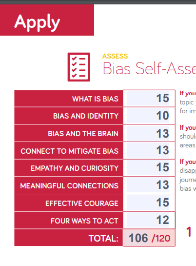

## Growth mindset
in generl is the belief that one's abilities, talents, and intelligence can be developed through hard work, dedication, and persistence. This concept was developed by Stanford psychologist Carol Dweck and contrasts with a fixed mindset, where people believe their qualities and abilities are fixed and unchangeable.

you want to improve yourself, you need to be willing to try new things that may be outside of your comfort zone. This could include learning new skills, like coding or a new language, even if you don't have any experience. By doing this, you give yourself the opportunity to grow and develop. Even if you face difficulties, with a growth mindset, you see them as opportunities to learn and become better. As you work towards your goals, you will also develop important skills like managing your time and yourself. In the end, having a growth mindset can lead to more success and happiness in your life.

## Based on the results of the Bias Self-Assessment, the scores I received are as follows : 
**scores: 106/120**
In the Bias Self-Assessment, a score between 100 and 120 indicates that I have a noteworthy level of self-awareness, curiosity, and courage. This result is encouraging because it shows that I am proactive in examining my thoughts and behaviors and am prepared to face any biases or assumptions I may have. I may become a more compassionate and accepting person and significantly contribute to the creation of a just and fair society by becoming aware of my own biases and taking positive steps to overcome them.

## Based on My results from the Emotional Intelligence Test include the following scores (out of 25):

My results from the Emotional Intelligence Test show that I scored 19 points in self-awareness, 23 points in self-management, 20 points in social awareness, and 25 points in relationship management, out of a total of 25 points. These scores indicate that I have a relatively high level of emotional intelligence, particularly in the areas of self-management and relationship management.

Having scored 19 in self-awareness, it suggests that I may benefit from spending more time reflecting on my emotions and how they impact my thoughts and behaviors.

A score of 23 in self-management demonstrates that I have good control over my emotions and can regulate them effectively, which is an essential skill in navigating challenging situations and maintaining positive relationships with others.

With a score of 20 in social awareness, it suggests that I have a good understanding of the emotions and needs of others, which is valuable in building strong relationships and working effectively in a team.

Lastly, a score of 25 in relationship management indicates that I am skilled at building and maintaining positive relationships with others, and can communicate effectively, resolve conflicts constructively, and work collaboratively to achieve shared goals.

Overall, these scores indicate that I have a strong foundation in emotional intelligence and possess many of the essential skills needed for success in personal and professional relationships. However, there is always room for improvement, and continuous practice and development can help me enhance my emotional intelligence even further and build even stronger relationships with others.
