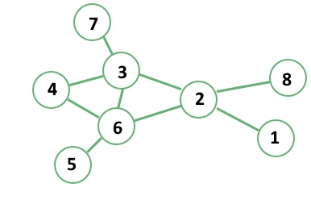
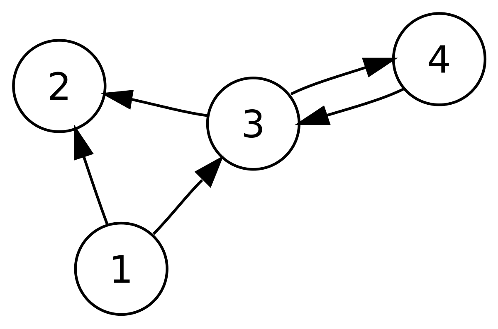

## **_Graphs_**

A graph is a non-linear data structure that can be looked at as a collection of vertices (or nodes) potentially connected by line segments named edges

## ***_Common terminology used when working with Graphs:_**

1. **Vertex** - A vertex, also called a “node”, is a data object that can have zero or more adjacent vertices.
2. **Edge** - An edge is a connection between two nodes.
4. **Neighbor** - The neighbors of a node are its adjacent nodes, i.e., are connected via an edge.
4. **Degree** - The degree of a vertex is the number of edges connected to that vertex.

## **_Directed vs Undirected_**

An Undirected Graph is a graph where each edge is undirected or bi-directional. This means that the undirected graph does not move in any direction.

The undirected graph we are looking at has 8 vertices and 9 undirected edges.

Vertices/Nodes = {1,,2,3,4,5,6,7,8}

Edges = {(1,2),(8,1),(2,6),(2,3),(3,6),(3,7),(6,5),(4,6),(4,3)}

## **_Directed Graphs (Digraph)_**

A Directed Graph is a graph where each edge is directed. This means that the graph moves in one direction. Also called a **Digraph**

 

The directed graph  has 4 vertices and 5 directed edges

Vertices = {1,2,3,4}

Edges = {(4,3),(3,4),(1,3),(3,2),(1,2)}

## **_Complete vs Connected vs Disconnected_**

There are **many different types of graphs**. **This depends on how connected the graphs are to other node/vertices.**

The three different types are completed, connected, and disconnected.

1. **Complete Graphs:** 

    A complete graph is when all nodes are connected to all other nodes.
    
2. **Connected Graphs:**

    A connected graph is graph that has all of vertices/nodes have at least one edge.

3. **Disconnected**

    A disconnected graph is a graph where some vertices may not have edges.

