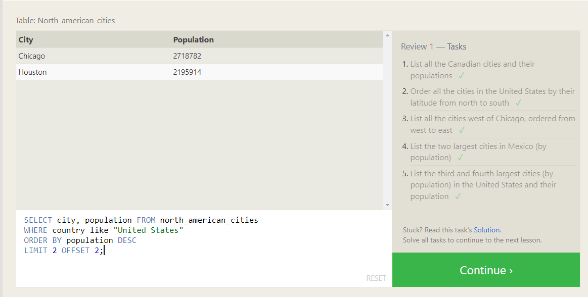

SQL is a standard language for storing, manipulating and retrieving data and it’s a for accessing and manipulating databases.

Database Tables
A database most often contains one or more tables. Each table is identified by a name (e.g. "Customers" or "Orders"). Tables contain records (rows) with data.
•	The SQL SELECT Statement
The SELECT statement is used to select data from a database.

•	The SQL SELECT DISTINCT Statement
The SELECT DISTINCT statement is used to return only distinct (different) values

•	The SQL WHERE Clause
The WHERE clause is used to filter records.
It is used to extract only those records that fulfill a specified condition.

•	The NOT Operators
The WHERE clause can be combined with AND, OR, and NOT operators.
The NOT operator displays a record if the condition(s) is NOT TRUE.

•	The SQL ORDER BY Keyword
The ORDER BY keyword is used to sort the result-set in ascending or descending order.

•	The SQL LIKE Operator
The LIKE operator is used in a WHERE clause to search for a specified pattern in a column.

•	The SQL BETWEEN Operator
The BETWEEN operator selects values within a given range. The values can be numbers, text, or dates.

•	SQL INNER JOIN Keyword
The INNER JOIN keyword selects records that have matching values in both tables.

•	The SQL INSERT INTO Statement
The INSERT INTO statement is used to insert new records in a table.

•	The SQL UPDATE Statement
The UPDATE statement is used to modify the existing records in a table.

•	The SQL DELETE Statement
The DELETE statement is used to delete existing records in a table.

